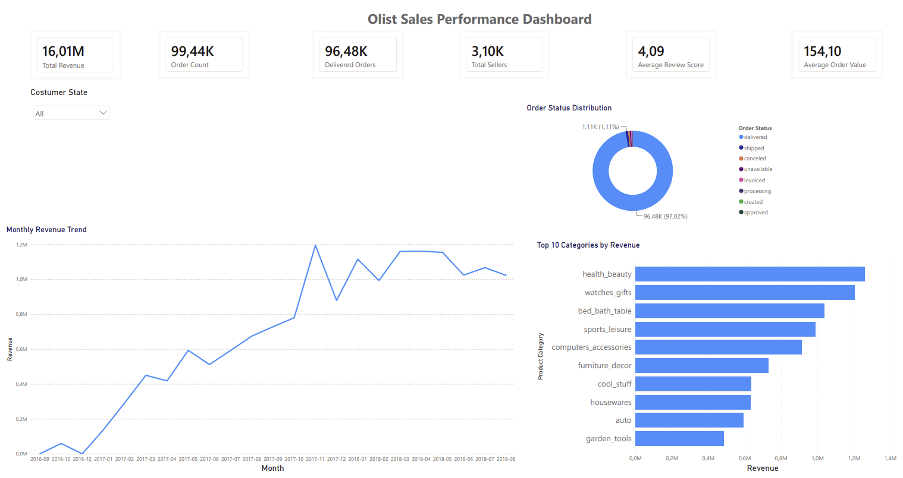

# 📊 Sales Performance Dashboard

End-to-end data analytics project using **SQL** and **Power BI** to analyze sales performance from the **Olist Brazilian E-commerce Dataset**.

This dashboard provides business insights into revenue, order fulfillment, customer distribution, seller activity, and product category performance through interactive visualizations.

## Dashboard Preview



## 📊 Dashboard Highlights

- Total Revenue
- Order Count
- Delivered Orders
- Total Sellers
- Average Review Score
- Average Order Value
- Monthly Revenue Trend
- Order Status Distribution
- Top 10 Product Categories by Revenue

---

## 🛠 Tools Used

- SQL
- Power BI
- Olist Brazilian E-commerce Dataset

---

## 📂 Project Structure

```
sales-performance-dashboard/
│
├── data/
├── images/
├── powerbi/
├── sql/
└── README.md
```

---

## 📌 Dataset

Olist Brazilian E-commerce Public Dataset.
